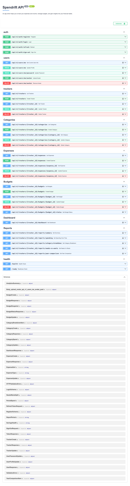
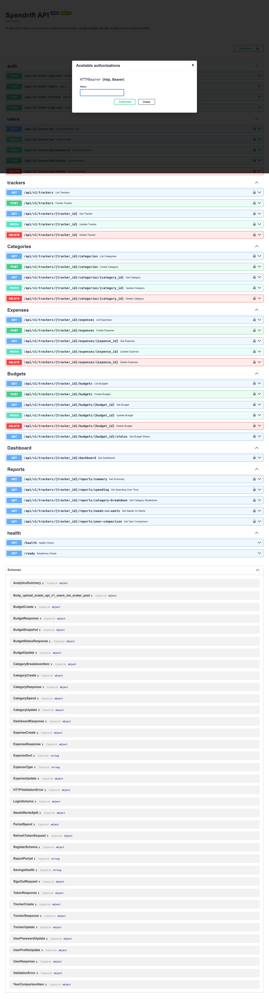
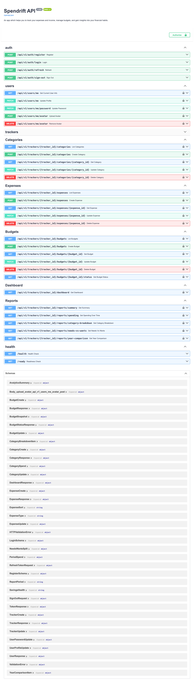

# Spendrift — Personal Finance Backend

> A multi-tracker personal finance API built with FastAPI, SQLModel, and PostgreSQL.

**Author**: Dipto Karmakar  
**License**: [AGPL-3.0](LICENSE) — free to study, not free to commercialize

---

## What is Spendrift?

Spendrift is a personal finance backend where each user can manage multiple **Trackers** (e.g. a "Bangladesh Tracker" in BDT, a "Europe Tracker" in EUR). Every tracker is an independent workspace with its own expenses, categories, and budgets.

## Stack

- **FastAPI** — async REST API
- **SQLModel + Alembic** — ORM and migrations
- **PostgreSQL 18** — primary database
- **Pydantic v2** — request/response validation
- **Argon2 + JWT** — authentication
- **SlowAPI** — rate limiting
- **Docker** — local development

## Features

| Module     | Status      |
|------------|-------------|
| Auth       | Complete    |
| Users      | Complete    |
| Trackers   | Complete    |
| Categories | Complete    |
| Expenses   | Complete    |
| Budgets    | Complete    |
| Dashboard  | Complete    |
| Reports    | Complete    |

## Getting Started

### Prerequisites

- Docker (for PostgreSQL)
- Python 3.11+
- `uv` package manager
- S3-compatible object storage (Cloudflare R2, MinIO, AWS S3) for avatar uploads

### Setup

```bash
# 1. Start PostgreSQL
docker-compose up -d

# 2. Install dependencies
pip install -e ".[postgres]"

# 3. Copy and configure environment
cp .env.example .env
# Edit .env with your DATABASE_URL, SECRET_KEY, and STORAGE_* credentials

# 4. Apply migrations
make upgrade

# 5. Start the API
make run
```

API runs at `http://localhost:8000`  
Interactive docs at `http://localhost:8000/docs`

## Key Commands

```bash
make run          # Start API with hot reload (port 8000)
make migrations   # Generate Alembic migration
make upgrade      # Apply pending migrations
make test         # Run test suite
make lint         # ruff + mypy
```

## Screenshots

### API Documentation (Swagger UI)



### Auth Endpoints



### Tracker Endpoints



### Expense Endpoints


## Sample API Responses

### Register / Login

```json
POST /api/v1/auth/register → 200
{
  "access_token": "<jwt>",
  "refresh_token": "<jwt>",
  "token_type": "bearer"
}
```

### Get current user

```json
GET /api/v1/users/me → 200
{
  "id": "203a029c-f5a5-4c70-8115-219b807f7951",
  "name": "Demo User",
  "email": "demo@example.com",
  "is_active": true,
  "avatar_url": null,
  "created_at": "2026-06-19T16:13:20.626774Z",
  "updated_at": "2026-06-19T16:13:20.626785Z"
}
```

### Create a tracker (auto-seeds 10 categories)

```json
POST /api/v1/trackers → 201
{
  "id": "2d35de32-f10d-4aec-833e-0e94d5e9bdd6",
  "name": "My Finances",
  "currency": "USD",
  "created_at": "2026-06-19T16:13:28.359432Z",
  "updated_at": "2026-06-19T16:13:28.359438Z"
}
```

### Auto-seeded categories

```json
GET /api/v1/trackers/{id}/categories → 200
[
  { "name": "Groceries",     "color": "#22C55E" },
  { "name": "Transport",     "color": "#3B82F6" },
  { "name": "Dining",        "color": "#F97316" },
  { "name": "Subscriptions", "color": "#8B5CF6" },
  { "name": "Entertainment", "color": "#EC4899" },
  { "name": "Health",        "color": "#14B8A6" },
  { "name": "Shopping",      "color": "#EAB308" },
  { "name": "Utilities",     "color": "#06B6D4" },
  { "name": "Coffee",        "color": "#A855F7" },
  { "name": "Uncategorized", "color": "#78716C" }
]
```

## API Overview

Base path: `/api/v1`

| Group      | Endpoints                                      |
|------------|------------------------------------------------|
| Auth       | `POST /auth/{register,login,refresh,sign-out}` |
| Users      | `GET/PATCH /users/me`, `PATCH /users/me/password`, `POST/DELETE /users/me/avatar` |
| Preferences | `GET/PUT /preferences`                        |
| Trackers   | `CRUD /trackers`                               |
| Categories | `CRUD /trackers/{id}/categories`               |
| Expenses   | `CRUD /trackers/{id}/expenses` (filter/sort/paginate) |
| Budgets    | `CRUD /trackers/{id}/budgets`, `GET .../{id}/status` |
| Budget Alerts | `GET /trackers/{id}/budget-alerts`          |
| Dashboard  | `GET /trackers/{id}/dashboard`                 |
| Reports    | `GET /trackers/{id}/reports/{summary,spending,category-breakdown,needs-vs-wants,year-comparison}` |

## Project Structure

```text
backend/
├── app/
│   ├── main.py           # FastAPI app entry point
│   ├── api/v1/           # Router registration
│   └── core/             # Config, DB session, security
├── modules/
│   ├── auth/             # JWT auth
│   ├── users/            # User profile
│   ├── trackers/         # Tracker workspaces
│   ├── categories/       # Expense categories
│   ├── expenses/         # Expense records
│   ├── budgets/          # Budget limits
│   ├── dashboard/        # Summary aggregations
│   └── reports/          # Detailed reports
├── alembic/              # Database migrations
├── tests/                # Pytest suite
├── docker-compose.yml
├── Makefile
└── pyproject.toml
```

## License

Copyright (c) 2026 Dipto Karmakar

This project is licensed under the **GNU Affero General Public License v3.0 (AGPL-3.0)**.  
See the [LICENSE](LICENSE) file for full terms.

**In plain English:**

- You may study and use this code for personal/educational purposes
- If you modify and distribute it, you must open-source your version under AGPL-3.0
- You may **not** use this in a commercial product or SaaS without written permission from the author
- You **must** credit the original author (Dipto Karmakar) in any derivative work

For commercial licensing inquiries: [diptokmk47@gmail.com](mailto:diptokmk47@gmail.com)
